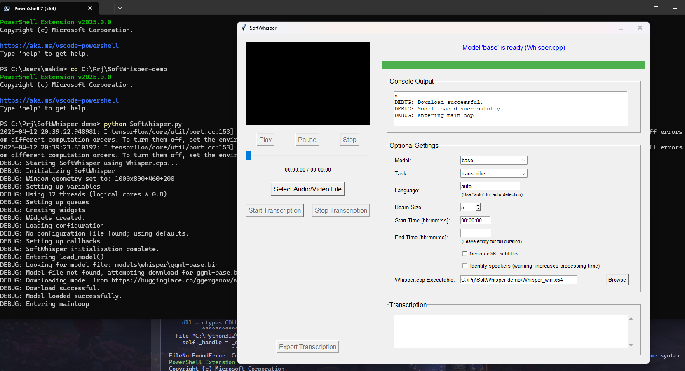

<h1 align="center">SoftWhisper 🎤✨</h1>

<p align="center">
   <a href="README_JP.md"></a>
   <a href="README_EN.md"></a>
</p>

<p align="center">
   
</p>

<p align="center">
   
   
   
</p>

A software that makes speech recognition and speaker diarization easy!

## Requirements

- Python 3.7 or higher
- FFmpeg
- VLC Media Player

## Installation

1. Clone this repository:
```bash
git clone https://github.com/NullMagic2/SoftWhisper .
```

2. Install required software:
   - [Python](https://www.python.org/downloads/) (3.7 or higher)
   - [FFmpeg](https://ffmpeg.org/download.html)
   - [VLC Media Player](https://www.videolan.org/vlc/)

3. Install dependencies:
```bash
pip install -r requirements.txt
```

## Usage

1. Run SoftWhisper.bat:
```bash
.\SoftWhisper.bat
```

2. When the GUI launches, follow these steps for transcription:
   - Select an audio/video file
   - Choose a model size (tiny, base, small, medium, large)
   - Enable speaker diarization if needed
   - Click the "Start" button

<p align="center">
   
</p>

## Features

- 🎯 High-accuracy transcription (using Whisper model)
- 👥 Speaker diarization (identify who is speaking)
- 🌍 Multi-language support
- 🎮 User-friendly GUI interface

## Troubleshooting

### Common Issues

1. `libvlc.dll not found` error
   - Make sure VLC Media Player is installed
   - Restart the program after installation

2. FFmpeg error
   - Ensure FFmpeg is properly installed and added to PATH

## License

[MIT License](LICENSE)

## Acknowledgments

This project uses the following open-source projects:
- [Whisper](https://github.com/openai/whisper)
- [inaSpeechSegmenter](https://github.com/ina-foss/inaSpeechSegmenter)
- [FFmpeg](https://ffmpeg.org/)
